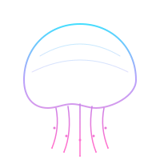
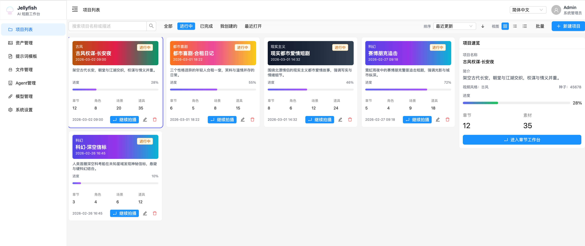

# Jellyfish — AI Short Drama Studio

<p align="center">
  
</p>

<p align="center">
  <a href="https://www.apache.org/licenses/LICENSE-2.0">
    
  </a>
  <a href="https://img.shields.io/badge/frontend-React%20%2B%20Vite-61DAFB">
    
  </a>
  <a href="https://img.shields.io/badge/backend-FastAPI-009688">
    
  </a>
  <a href="https://github.com/Forget-C/Jellyfish/actions/workflows/deploy-site.yml">
    
  </a>
  <a href="https://github.com/Forget-C/Jellyfish/actions/workflows/ghcr-images.yml">
    
  </a>
</p>

<p align="center">
  <a href="./README.md">English</a> ·
  <a href="./docs/README.ja.md">日本語</a>
</p>

An end-to-end production workspace for AI-generated short dramas.  
From script input to structured storyboarding, consistency management,
shot preparation, video generation, and export.

## 📷 Screenshots

| Project overview | Asset management |
| --- | --- |
|  |  |

## ✨ Core Value

- **Connect the full production flow**: Move from script input to storyboard preparation, image/video generation, and task tracking in one place.
- **Turn AI output into reusable production assets**: Shots, candidate assets, dialogue, prompts, and generation tasks can all be reviewed and reused.
- **Treat consistency as a first-class problem**: Centralized character, scene, prop, and costume management reduces drift across shots.
- **Handle long-running generation as trackable tasks**: Text, image, and video jobs all go through one async task system with status, cancel, and recovery.
- **Build AI capability as infrastructure**: Model management, prompt templates, files, and OpenAPI-based collaboration make the system extensible.

## ✨ Core Capabilities

Jellyfish is not just a single “AI image/video” utility. It is a
production workspace built around:

- script understanding
- shot preparation
- asset consistency
- generation execution
- task tracking

### 1. AI script understanding and storyboard breakdown

- Split chapter scripts into shots
- Extract characters, scenes, props, costumes, and dialogue
- Run script optimization, simplification, and consistency checks
- Support targeted analysis such as character portraits or scene details

### 2. Shot preparation and confirmation workflow

The main workflow is:

`script breakdown → shot preparation → candidate confirmation → shot ready → generation workspace`

Preparation currently supports:

- extracting and refreshing shot candidates
- accepting or ignoring asset candidates
- accepting or ignoring dialogue candidates
- linking existing characters, scenes, props, and costumes
- correcting shot-level basic information
- using a unified readiness state to decide whether a shot is prepared

### 3. Asset consistency and reuse

The system maintains a shared entity model across:

- characters / actors
- scenes
- props
- costumes

This supports asset reuse across shots and helps stabilize style and identity.

### 4. Shot-level image and video orchestration

Once a shot is `ready`, the generation workspace supports:

- keyframe and reference image management
- shot-level video prompt preview
- image and video generation tasks
- single-shot and batch pre-checks
- writing generation outputs back into the shot/media system

### 5. Unified async task center

Current task infrastructure supports:

- async text-processing tasks
- async image and video generation tasks
- unified task status, result, and elapsed-time tracking
- task cancellation
- a global task center with context-aware navigation back to project/chapter/shot

### 6. Model, prompt, and generation infrastructure

Supporting capabilities include:

- multi-provider / multi-model management
- default model settings by category
- prompt template management
- file and generated media management
- OpenAPI-driven frontend/backend contracts

## 🚀 Feature Overview

### Project and chapter management

- Create and manage projects and chapters
- Use chapters as the unit for scripts, shots, and generation
- Provide dashboard-style entry points and aggregated stats

### AI script processing

- Break chapter scripts into shots
- Extract characters, scenes, props, costumes, and dialogue
- Support optimization, simplification, and consistency checks
- Support focused analysis such as character portraits or scene information

### Shot preparation workflow

- Edit shot title, summary, and basic information
- Refresh extracted asset and dialogue candidates
- Confirm, ignore, or link candidate items
- Use preparation state to determine shot readiness
- Keep “prepared” distinct from “currently generating”

### Asset and entity management

- Manage characters, actors, scenes, props, and costumes
- Link and reuse them at shot level
- Manage entity images
- Check name existence to encourage reuse of existing assets

### Shot generation workspace

- Manage keyframes, reference images, and video prompts
- Check video readiness before generation
- Launch image/video generation tasks
- Support both single-shot and batch generation workflows

### Task center

- View active and recently finished tasks
- Track status, progress, elapsed time, and results
- Cancel tasks
- Jump back to the related project, chapter, or shot

### Model and prompt infrastructure

- Manage providers, models, and default settings
- Manage prompt templates for images, video, and shots
- Generate frontend request helpers and types from OpenAPI
- Provide a stable base for future AI workflow expansion

### File and media management

- Manage uploads and generated outputs
- Preview, link, and reuse image/video assets
- Preserve shot and entity context around generated media

## 🎯 Use Cases

- Short / micro-drama creators
- AI studios producing video content in batches
- Solo creators exploring vertical drama production
- Education and training teams making lesson videos
- Brands and e-commerce teams producing story-driven promos

## 🔁 Frontend OpenAPI client and type generation

Frontend request helpers and types are generated from the backend
OpenAPI spec. Output directory:

- `front/src/services/generated/`

Cached spec file:

- `front/openapi.json`

With the backend dev server running at `http://127.0.0.1:8000`, run:

```bash
cd front
pnpm run openapi:update
```

## 🐳 Docker Compose

The repository includes a ready-to-run compose setup under
`deploy/compose/`.

### Ports

- Frontend: `http://localhost:7788`
- Backend: `http://localhost:8000` (`/docs` for Swagger)
- MySQL: `localhost:${MYSQL_PORT:-3306}`
- Redis: `localhost:${REDIS_PORT:-6379}`
- RustFS: `http://localhost:${RUSTFS_PORT:-9000}`

### Start

```bash
cp deploy/compose/.env.example deploy/compose/.env
docker compose --env-file deploy/compose/.env -f deploy/compose/docker-compose.yml up --build
```

## 🧑‍💻 Local Development

### Backend

```bash
cd backend
cp .env.example .env
uv sync
uv run uvicorn app.main:app --reload --host 0.0.0.0 --port 8000
```

### Frontend

```bash
cd front
pnpm install
pnpm dev
```

## 📄 License

This project is licensed under [Apache-2.0](./LICENSE).

## 💬 Community & Feedback

- [GitHub Issues](https://github.com/Forget-C/Jellyfish/issues)

